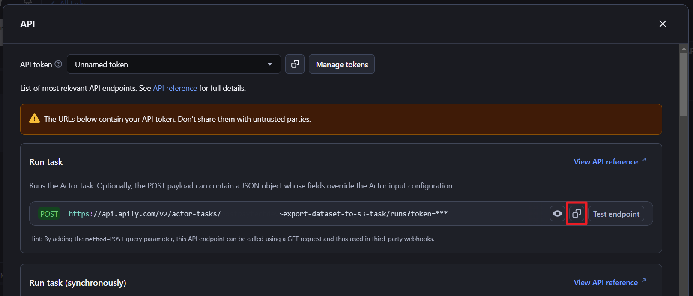

<div align="center">

# Export Dataset to S3


</div>
This is an Apify actor to export dataset of another actor to S3 bucket.

The API endpoints of this actor can integrate to webhook of another actor that trigger on `Run succeeded`.

There is another [actor](https://apify.com/drinksight/save-to-s3) in the store already, you may want to have a look with it. Maybe it work best to your use case.

## Getting started

### Create AWS IAM User  
Before you start using this actor, make sure you have the access to AWS and create a dedicated IAM user *(recommended)*.  

Example policy (to be attached the IAM user):
```json
{
    "Version": "2012-10-17",
    "Statement": [
        {
            "Sid": "UploadObjectsStatement",
            "Effect": "Allow",
            "Action": [
                "s3:PutObject"
            ],
            "Resource": [
                "arn:aws:s3:::<BUCKET-NAME>/*"
            ]
        }
    ]
}
```

### Create access key
Once you create IAM user, create access key.


### Create Task
1. Create a new task.
  
> ⚠️ You need to fill in properties especially AWS Access Key ID and AWS Secret Access Key to create new task.

2. Change the Title according to your preference.


Properties:
| Property                | Description                                                                                  |
|-------------------------|----------------------------------------------------------------------------------------------|
| `aws_access_key_id`     | The access key id for your AWS account.                                                      |
| `aws_secret_access_key` | The secret access key for your AWS account.                                                  |
| `aws_region`            | Enter the AWS region for your S3 bucket. e.g. us-east-1                                      |
| `aws_bucket`            | Enter the name of the S3 bucket to use.                                                      |
| `aws_object_key_format` | They key to use for the aws filename.                                                        |
| `format`                | The format of the dataset.                                                                   |
| `clean`                 | If `true` or `1` then the API endpoint returns only non-empty items and skips hidden fields. |
| `offset`                | Number of items that should be skipped at the start. The default value is `0`.               |
| `limit`                 | Maximum number of items to return. By default there is no limit.                             |
| `gzip_compression`      | Whether to compress the exported data. By default `gzip_compression=true`                    |


### Copy Webhook link
1. Once you create a new task. You can get API endpoint from the API button from top right.


2. Copy **Run Task** URL.



### Create webhook integration
1. Go the the Actor/Actor Task (Google Maps Scraper in this example), click on intergration tab. Seach for webhook. 


2. Add the API endpoint copied to URL and set the event types to be `Run succeeded`. Leave the Payload template as it is.
